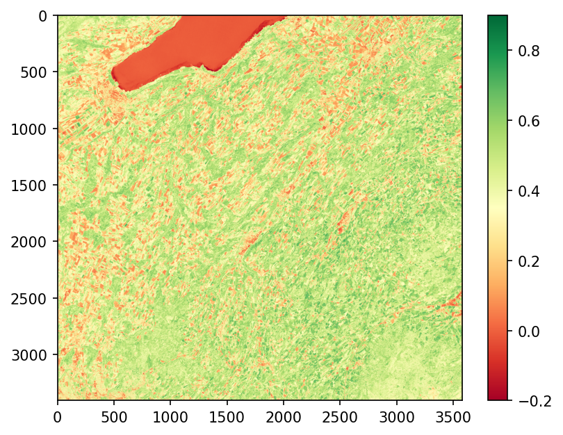
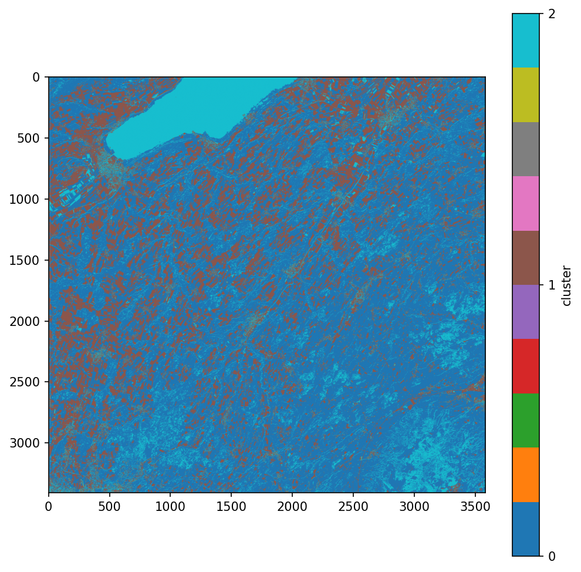

# Sentinel-2 NDVI and Land-Cover Clustering

Proof-of-concept pipeline that computes NDVI from Sentinel-2 red and near-infrared
bands and groups pixels into land-cover classes with KMeans (Python, Rasterio,
scikit-learn).

## Data
- Sentinel-2 L2A, tile T32TLS, acquired 25 Sep 2026
- Bands: B04 (red) and B08 (NIR), 10 m resolution, merged with GDAL
- Source: quickmaptools.com satellite imagery download
- The input GeoTIFF is not included because of its size.

## Method
1. Read red and NIR bands with Rasterio.
2. Mask empty (nodata) pixels.
3. Compute NDVI = (NIR − Red) / (NIR + Red).
4. Cluster pixels on [red, NIR, NDVI] (standardized) with KMeans, k = 3
   (chosen by silhouette score: [k=2: _, k=3: _, k=4: _]).

## Results

| Cluster | Mean NDVI | Share of pixels | Interpretation |
|---|---|---|---|
| 0 | [ ] | [ ] | [ ] |
| 1 | [ ] | [ ] | [ ] |
| 2 | [ ] | [ ] | [ ] |

## Limitations
- Unsupervised: clusters are interpreted from NDVI values, not validated
  against reference land-cover data.
- Tested on one scene (western Switzerland) as a proof of concept.

## Next steps
- Apply the pipeline to Bangladesh scenes.
- Validate with labelled reference data and try supervised models
  (e.g., Random Forest).

## How to run
1. Download Sentinel-2 L2A bands B04 (red), B08 (NIR) and B09 for the same
   scene (see Data above). B09 is only included because it was in my merged
   file; it is not used in the analysis.
2. Merge them into one 3-band GeoTIFF, keeping this order
   (band 1 = B04, band 2 = B08, band 3 = B09):
   `gdal_merge.py -separate -o merged.tif B04.tif B08.tif B09.tif`
3. Upload `merged.tif` to Google Drive (folder `sparrso`) or change the path
   in the notebook cell that opens it.
4. Open `ndvi_landcover_kmeans.ipynb` in Google Colab and run all cells.
